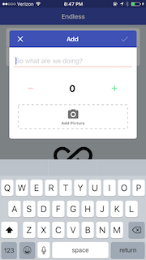

This is a prototype app built in React Native.  It is a task list that you can add tasks to along with a picture.  It is not overly complex, but it takes a fairly simple idea an adds some cool features. The app uses Redux and Redux persist to manage state and make sure that the app repopulates correctly.  (Screenshots coming soon)

## Features
* Add a task to your list 
  * Add a picture to make finding the same thing easier
  * Add a quantity (for things like groceries)

    

* View the sorted task list (Sorted by pending or completed and then alphabetically)
    

* Expand that task in the list to view more info like the picture
  * Complete/Uncomplete the task
  * Remove the specific task
    
    

* Select any number of items in the list by long clicking and dragging
  * Remove the selected items
  * Complete the selected items

    

* Remove all of the completed items
* Persisting all of your tasks using Redux-Persist

## How to run

1. Clone the github repo
2. `npm install` in the cloned directory
3. Download the expo app
4. `npm start` in the cloned directory
5. Open the expo app
6. Scan the QR code and try it out